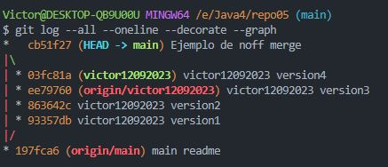

# EJERCICIO 5: NO FAST FORWARD

### 5.1 – Crea un directorio llamado repo05, esta vez tu decides como lo haces. Es decir, tendrás que seleccionar uno de los dos caminos que hemos visto en los dos ejercicios anteriores. Pero si que queremos que exista el repositorio el local y en remoto.
***
### 5.2 – Crea el fichero readme.md

Realizamos los mismos pasasos que en repo04.

***
### 5.3 - Crea una rama con tu nombre y la fecha actual (por ejemplo en mi caso la rama  se llamará david02032022) y sitúate en dicha rama

***
### 5.4 – Haz 3 commits en la rama (david02032022)

Realizamos mediante:  
    
    $git add README.md
    $git commit -m "nombre del commit"

***
### 5.5 – En este caso, antes de hacer el merge sube ambas ramas al repositorio remoto. Verifica que se hayan subido correctamente. Lo hacemos así, ya que cuando realicemos el merge si nos equivocas podemos volver a clonar el repositorio sin necesidad de tener que volver a comenzar el ejercicio de 0.

    Mediante el comando añadimos la rama "victor12092023" a remoto:
    $ git push --set-upstream origin victor12092023 

    Desde la pagina web de github lo revisamos:

    

***
### 5.6 – Basándote en el ejemplo que hemos visto anteriormente, realiza un commit no fast-forward en el que mergearemos la rama david02032022 con master.

    Con el comando:
    $ git merge --no-ff victor12092023 -m "nombre ..."

***
### 5.7 – Visualiza el resultado tanto mediante el comando git log --all --oneline --decorate --graph, como desde el pluging de VSC

    Mediante el comando:
    $ git log --all --oneline --decorate --graph

    Y con el pluging

***
### 5.8 – Explica las diferencias entre un merge FF y un merge no FF

Merge Fast-Forward (FF):
- Se utiliza para mantener la historia simple y cuando trabajas en ramas temporales.

Merge No Fast-Forward (No FF):
- Se utiliza para mantener un registro explícito de cuándo se integraron cambios y muestra claramente la fusión en la historia del proyecto.